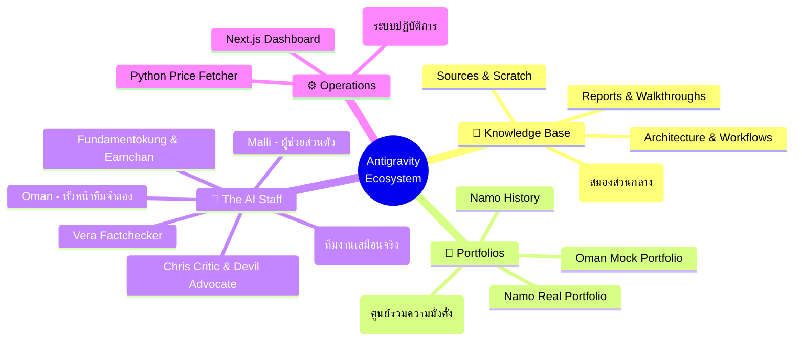
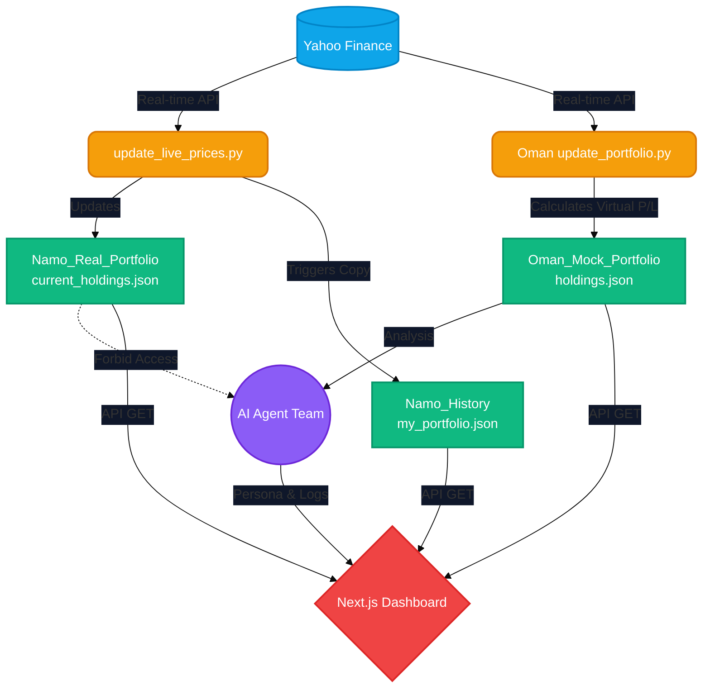

# 🌐 แผนผังโครงสร้างระบบองค์กร (Macro System Architecture)

เอกสารฉบับนี้คือ **แผนที่ระดับผู้บริหาร (Executive Map)** ที่อธิบายความสัมพันธ์ของทุกส่วนประกอบใน `antigravity-office-workspace` ซึ่งถูกออกแบบให้ทำงานร่วมกันอย่างสมบูรณ์แบบ ทั้งในด้านข้อมูล, ทีมงาน AI, และการปฏิบัติการพอร์ตลงทุน

---

## 🧠 1. ระบบนิเวศน์แบบองค์รวม (The Ecosystem Mindmap)
ภาพรวมทั้งหมดของโครงสร้างโฟลเดอร์และระบบต่างๆ ของเรา

---

## 🔄 2. สายพานข้อมูลและการทำงาน (The Data Pipeline)
กระบวนการตั้งแต่ดึงราคาตลาดสด จนถึงการประมวลผลให้ผู้บริหารดูบน Dashboard

> [!TIP]
> **ระบบอัตโนมัติ 100%**
> เพียงบอสสั่งรันscriptในโฟลเดอร์ `Scripts/` ระบบจะดึงข้อมูลสดจากตลาดหุ้นสหรัฐฯ มาupdateไฟล์ JSON และสะท้อนภาพเข้าสู่ Dashboard ทันทีโดยไม่ต้องแก้codeเอง

---

## 🛡️ 3. กฎความปลอดภัยระดับสูง (Security & Blindness Rule)
เพื่อให้การทดสอบกลยุทธ์ของพอร์ตจำลอง (Oman) ไม่ถูกแทรกแซงจากอารมณ์และข้อมูลเงินจริงของบอส (Namo)

> [!CAUTION]
> **Namo's Blindness Rule**
> กฎข้อนี้บังคับใช้กับ **Agent Oman เท่านั้น** โดยห้าม Oman เข้าถึงโฟลเดอร์ `Portfolios/Namo_Real_Portfolio/` และ `Portfolios/Namo_History/` อย่างเด็ดขาด การตัดสินใจของ Oman ต้องขึ้นอยู่กับสภาพแวดล้อมจำลองและพื้นฐานของหุ้นเท่านั้น (Agent ตัวอื่นๆ สามารถเข้าถึงพอร์ตจริงได้หาก Namo สั่งการ)

## 👨‍💻 4. โครงสร้างทีมงาน AI (The Lean Roster)

| ทีม | ตำแหน่ง | หน้าที่หลัก |
|---|---|---|
| **Malli** | ผู้ช่วยส่วนตัว (Executive Assistant) | จัดการระบบทั้งหมด, สั่งรันcode, เชื่อมต่อและประสานงาน |
| **Oman** | ผู้จัดการกองทุน (Fund Manager) | บริหาร `Oman_Mock_Portfolio/`, ตัดสินใจซื้อ/ขาย |
| **Fundamentokung** | หัวหน้านักวิเคราะห์ (Fundamental Lead) | เจาะลึกงบการเงิน (10-K) และ Earnings Calls |
| **Newwy** | นักสืบและข่าวสาร (Scout & News) | หาข่าว, จับ Sentiment, และหาข้อมูลดิบเข้าserver |
| **Vera** | ผู้จัดการความเสี่ยง (Quant & Risk) | ยืนยันความถูกต้องของตัวเลข, คุมความเสี่ยงและ Sizing |
| **Reese** | ผู้จัดการความรู้ (Knowledge Curator) | สรุปบทเรียนข้ามสายงานและดูแล Knowledge Base |
| **TubeMaster** | ผู้กำกับยูทูป (YouTube Director) | ปั้นช่อง Namuay/NineByte, แต่งscript, ทำ SEO |

> [!NOTE]
> แผนผังนี้เป็นแบบแปลนที่มีชีวิต บอสสามารถดูได้จาก Dashboard และสามารถสั่งให้มะลิขยายสาขา (สร้าง Agent เพิ่ม หรือสร้างระบบย่อยเพิ่ม) ได้ตลอดเวลาเลยค่ะ!
