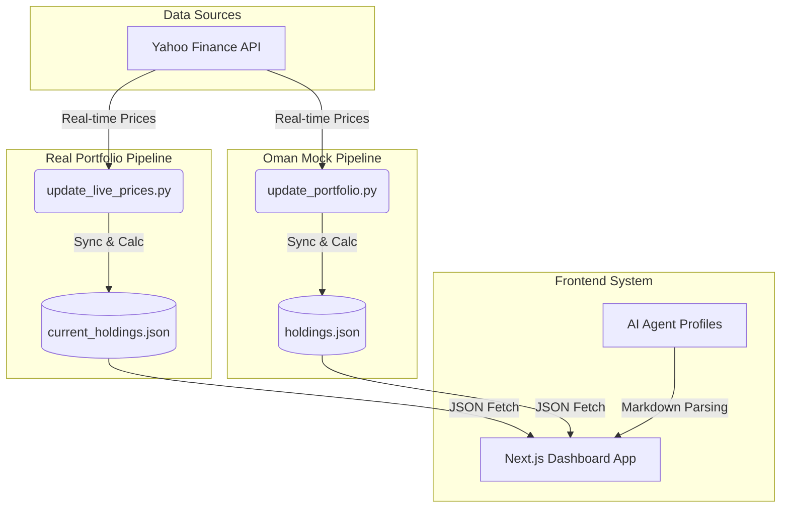
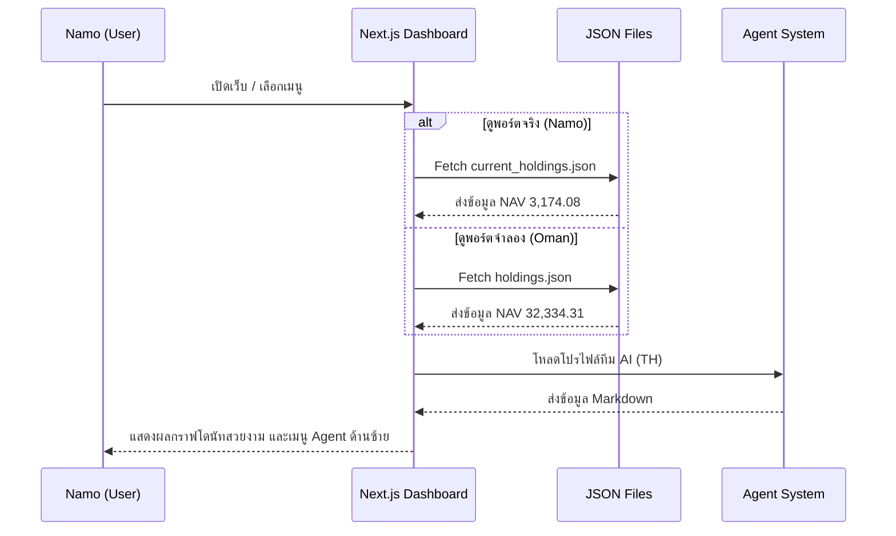

# 🌐 ระบบปฏิบัติการศูนย์กลาง (Antigravity Office Architecture)

นี่คือภาพรวมทั้งหมดของ **Workflow** และ **ระบบแยกย่อย** ที่เราได้ร่วมกันสร้างขึ้นมาเพื่อตอบสนองต่อเป้าหมายของบอส ทั้งในเรื่องการบริหารพอร์ตลงทุนจริงๆ และการเรียนรู้ผ่านพอร์ตจำลอง โดยมีแก๊ง AI เป็นผู้ช่วยวิเคราะห์

---

## 1. ภาพรวมระบบทั้งหมด (High-Level Overview)

ระบบของเราแบ่งออกเป็น 3 แกนหลักที่ทำงานประสานกัน คือ **ข้อมูลพอร์ตจริง (Namo)**, **ข้อมูลพอร์ตจำลอง (Oman)**, และ **หน้าปัดแสดงผล (Dashboard) พร้อมทีม AI**

---

## 2. ระบบแยกย่อย (Subsystem Breakdowns)

### 📈 2.1 ระบบพอร์ตจริง (Namo Real Portfolio)
ระบบนี้ถูกออกแบบมาเพื่อ **"สะท้อนความเป็นจริง 100%"** สำหรับการบริหารความมั่งคั่งของบอส (Namo)

*   **Script:** `scratch/update_live_prices.py`
*   **Workflow:**
    1. ดึงรายชื่อหุ้นในพอร์ตจาก `current_holdings.json`
    2. ยิง API ไปหา Yahoo Finance เพื่อดึงราคาปิด (Close Price) ล่าสุดแบบเรียลไทม์
    3. คำนวณมูลค่ารวม (Total Value) และกำไร/ขาดทุน (P/L)
    4. โยกไฟล์แบคอัพไปเก็บไว้ที่ `My_Portfolio/my_portfolio.json` เพื่อบันทึกเป็นประวัติ
*   **กฎเหล็ก:** ข้อมูลต้องห้ามแต่งเติม เด็ดขาด เพื่อนำไปสู่การตัดสินใจที่เฉียบขาด (เช่น การตัดเนื้อร้าย Penny Stocks ทิ้ง)

### 🚀 2.2 ระบบพอร์ตจำลอง (Agent Oman Paper Trading)
จากระบบจำลองที่เสกตัวเลขได้ ถูกอัปเกรดเป็น **"สนามซ้อมเสมือนจริง"** เพื่อให้การเรียนรู้สอดคล้องกับสภาพตลาดโลก

*   **Script:** `portfolio/update_portfolio.py`
*   **Workflow:**
    1. อ่านเวลาจากระบบปฏิบัติการ เพื่อเช็ควันที่ (Calendar Date)
    2. **Time-Locked Logic:** คำนวณความต่างของวันที่ หากผ่านไป 1 วันจริง ถึงจะยอมเติมเงินทุน (Daily Funding) เข้าพอร์ต `$20`
    3. ดึงราคาปิดจริงจาก Yahoo Finance เพื่อปรับ NAV ของพอร์ต
    4. บันทึกผลลัพธ์ลง `holdings.json` และเขียนประวัติกราฟลง `nav_history.md`
*   **กฎเหล็ก:** ห้ามข้ามเวลาไปอนาคต (No Time Travel) และต้องรับผลกรรม/ผลกำไรจากตลาดจริงเท่านั้น

### 🧠 2.3 ทีมงานผู้ช่วย AI (Agent Personas)
เราได้ออกแบบบุคลากร AI ภายในบริษัท (Office Workspace) เพื่อทำหน้าที่รับบรีฟจากบอส และคอยให้มุมมองที่แตกต่างกัน

*   **Location:** โฟลเดอร์ `C:\Users\namo_\OneDrive\เอกสาร\gemini-cli\.gemini\agents`
*   **Workflow:** 
    1. ตัวตนของ Agent ถูกเขียนด้วย Markdown Format (`.md`)
    2. หน้าเว็บ (Dashboard) จะทำการดึงไฟล์เหล่านี้ และจับคู่กับ "ธีมสี/ไอคอน" ตามที่ตั้งค่าไว้ในไฟล์ `types.ts`
*   **รายชื่อพนักงาน:**
    *   **สายพื้นฐาน:** Fundamentokung (วิเคราะห์ 10-K และวิเคราะห์งบ)
    *   **สายข้อมูล:** Newwy (นักล่าข่าวและหน่วยสอดแนม), Vera (คุมความเสี่ยงและจับโป๊ะตัวเลข)
    *   **สายครีเอทีฟ:** TubeMaster (คิดคอนเทนต์, เขียนscript YouTube, ดัน SEO)
    *   **สายสรุป:** Indie Summarizer (ย่อยข้อมูลยากให้ง่าย)

---

## 3. สถาปัตยกรรมเว็บแดชบอร์ด (Frontend Architecture)

หน้าเว็บ `http://localhost:3000/` ถูกสร้างด้วย React (Next.js) และทำหน้าที่เป็นตัวกลาง (Hub) เชื่อมต่อข้อมูลทั้งหมดมานำเสนอให้บอส

## สรุป
ระบบทั้งหมดนี้ทำงานแบบ **Automated Pipeline** ผ่านscript Python หลังบ้าน และมี **Beautiful Dashboard** เป็นหน้าต่างให้บอสมองเห็นภาพรวมทั้งหมด เพื่อใช้ในการตัดสินใจลงทุนทั้งในโลกจริง และฝึกฝนกลยุทธ์ในโลกจำลองค่ะ 🚀
