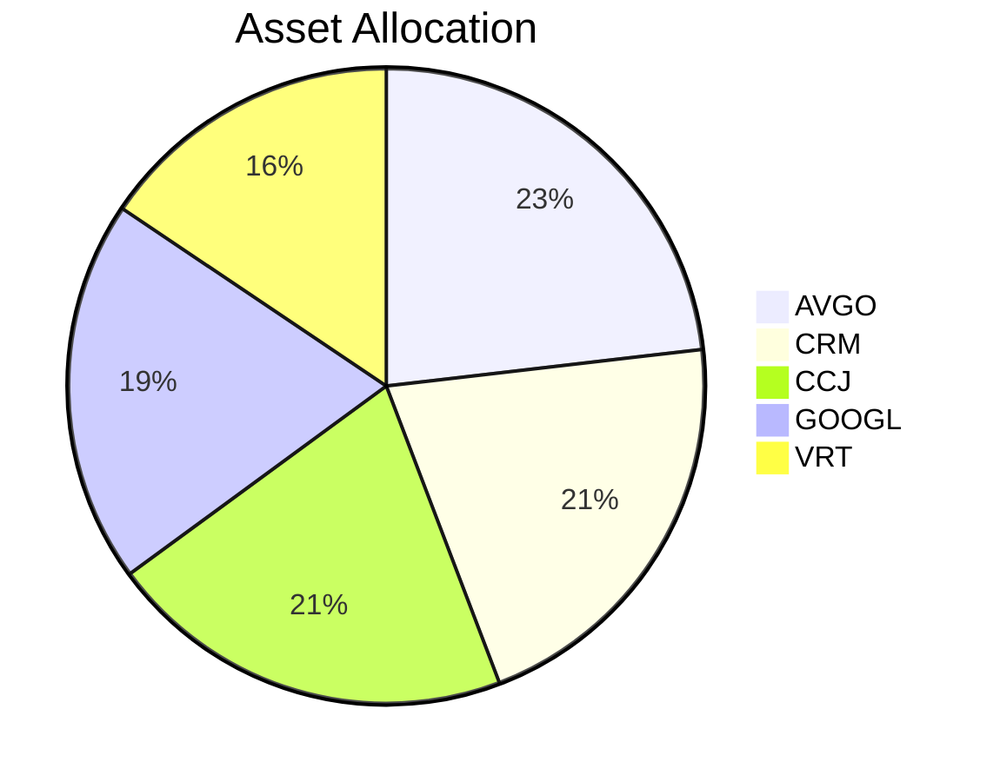

# 📊 DCA Diary (AI Dashboard)

> *Last Updated: 2026-05-30*

## 💳 Portfolio Metrics

| TOTAL VALUE | UNREALIZED P&L | REALIZED P&L | TOTAL DEPOSITED | DIVIDENDS |
| :--- | :--- | :--- | :--- | :--- |
| **$30,733.92** | **$452.13** (+1.49%) | **$0.00** | **$30,140.00** | **$0.00** |
| Cash: $340.00 | | | | |

---

## 🧭 Allocation & Insights

<table width="100%">
<tr>
<td width="50%" valign="top">

### 🍩 Allocation

</td>
<td width="50%" valign="top">

### 💡 Insights

- 📈 **Best performer:** CRM (+14.95%)
- 📉 **Worst performer:** VRT (-18.18%)
- 👑 **Largest position:** AVGO ($7,040.00, 22.91%)
- ⏳ **Longest hold:** VRT (11 days)
- 🔄 **Most-traded:** VRT (1 trades)
- 🕒 **Latest Action:** OMAN'S STRATEGY (2026-05-30 LATE PM): Executing Universe Management. Added DELL and PLTR to Watchlist based on Daily Insights (AI Server & Defense catalysts). Daily funding skipped as $40 was already added earlier today. Hold all current positions.

</td>
</tr>
</table>

---

## 📋 Holdings

| SYMBOL | NAME | QTY | AVG COST | LAST | MARKET VALUE | UNR. P&L | WEIGHT | DAYS HELD | REALIZED | DIV | #TRD |
| :--- | :--- | :--- | :--- | :--- | :--- | :--- | :--- | :--- | :--- | :--- | :--- |
| **VRT** | Vertiv Holdings Co | 17 | $340.31 | $278.43 | $4,733.31 | $-1,051.96 (-18.18%) | 15.4% | 11 | $0.00 | $0.00 | 1 |
| **AVGO** | Broadcom Inc. | 16 | $413.39 | $440.00 | $7,040.00 | $425.76 (+6.44%) | 22.91% | 11 | $0.00 | $0.00 | 1 |
| **CRM** | Salesforce, Inc. | 31 | $179.48 | $206.31 | $6,395.61 | $831.73 (+14.95%) | 20.81% | 11 | $0.00 | $0.00 | 1 |
| **GOOGL** | Alphabet Inc. | 15 | $398.80 | $395.10 | $5,926.50 | $-55.50 (-0.93%) | 19.28% | 11 | $0.00 | $0.00 | 1 |
| **CCJ** | Cameco Corporation | 57 | $105.20 | $110.50 | $6,298.50 | $302.10 (+5.04%) | 20.49% | 11 | $0.00 | $0.00 | 1 |

---
*Auto-generated by Malli-Daily protocol.*