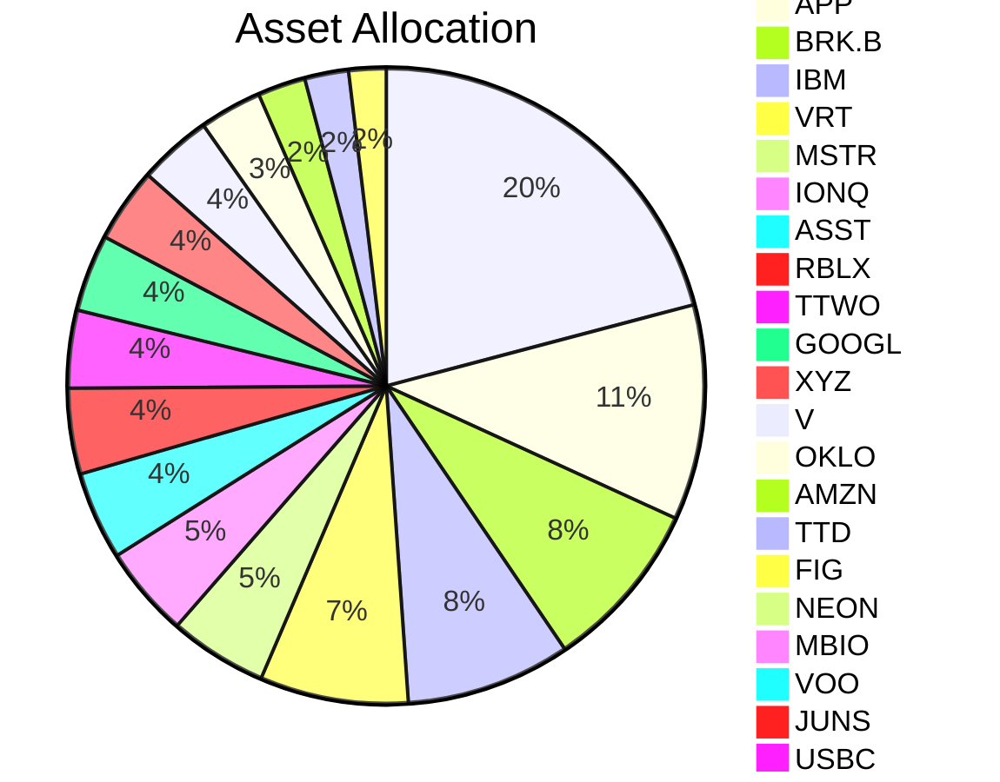

# 📊 My Personal Dashboard

> *Last Updated: 2026-05-28*

## 💳 Portfolio Metrics

| TOTAL VALUE | UNREALIZED P&L | REALIZED P&L | TOTAL DEPOSITED | DIVIDENDS |
| :--- | :--- | :--- | :--- | :--- |
| **$2,612.82** | **$-465.18** (-15.11%) | **$0.00** | **$3,078.00** | **$0.00** |
| Cash: $0.00 | | | | |

---

## 🧭 Allocation & Insights

<table width="100%">
<tr>
<td width="50%" valign="top">

### 🍩 Allocation

</td>
<td width="50%" valign="top">

### 💡 Insights

- 📈 **Best performer:** UNH (+52.71%)
- 📉 **Worst performer:** USBC (-92.12%)
- 👑 **Largest position:** UNH ($531.63, 20.35%)
- ⏳ **Longest hold:** UNH (0 days)
- 🔄 **Most-traded:** UNH (1 trades)

</td>
</tr>
</table>

---

## 📋 Holdings

| SYMBOL | NAME | QTY | AVG COST | LAST | MARKET VALUE | UNR. P&L | WEIGHT | DAYS HELD | REALIZED | DIV | #TRD |
| :--- | :--- | :--- | :--- | :--- | :--- | :--- | :--- | :--- | :--- | :--- | :--- |
| **UNH** | - | 1.3775 | $252.73 | $385.94 | $531.63 | $183.50 (+52.71%) | 20.35% | 0 | $0.00 | $0.00 | 1 |
| **BRK.B** | - | 0.4615 | $476.01 | $478.82 | $220.97 | $1.30 (+0.59%) | 8.46% | 0 | $0.00 | $0.00 | 1 |
| **APP** | - | 0.4634 | $461.06 | $601.63 | $278.80 | $65.14 (+30.49%) | 10.67% | 0 | $0.00 | $0.00 | 1 |
| **IBM** | - | 0.8029 | $244.11 | $265.70 | $213.33 | $17.34 (+8.85%) | 8.16% | 0 | $0.00 | $0.00 | 1 |
| **MSTR** | - | 0.8584 | $204.90 | $147.57 | $126.67 | $-49.21 (-27.98%) | 4.85% | 0 | $0.00 | $0.00 | 1 |
| **TTWO** | - | 0.4598 | $228.34 | $218.53 | $100.49 | $-4.51 (-4.29%) | 3.85% | 0 | $0.00 | $0.00 | 1 |
| **ASST** | - | 6.6000 | $25.77 | $17.28 | $114.05 | $-56.03 (-32.94%) | 4.37% | 0 | $0.00 | $0.00 | 1 |
| **RBLX** | - | 2.3529 | $72.25 | $47.08 | $110.78 | $-59.22 (-34.84%) | 4.24% | 0 | $0.00 | $0.00 | 1 |
| **V** | - | 0.2954 | $337.98 | $322.08 | $95.14 | $-4.69 (-4.7%) | 3.64% | 0 | $0.00 | $0.00 | 1 |
| **XYZ** | - | 1.3177 | $75.77 | $73.02 | $96.22 | $-3.62 (-3.63%) | 3.68% | 0 | $0.00 | $0.00 | 1 |
| **IONQ** | - | 1.6576 | $60.23 | $71.30 | $118.19 | $18.35 (+18.38%) | 4.52% | 0 | $0.00 | $0.00 | 1 |
| **OKLO** | - | 1.1443 | $139.60 | $70.47 | $80.64 | $-79.10 (-49.52%) | 3.09% | 0 | $0.00 | $0.00 | 1 |
| **AMZN** | - | 0.2289 | $218.06 | $270.77 | $61.99 | $12.07 (+24.18%) | 2.37% | 0 | $0.00 | $0.00 | 1 |
| **TTD** | - | 2.6647 | $51.56 | $21.30 | $56.74 | $-80.65 (-58.7%) | 2.17% | 0 | $0.00 | $0.00 | 1 |
| **FIG** | - | 2.1352 | $75.28 | $22.69 | $48.45 | $-112.29 (-69.86%) | 1.85% | 0 | $0.00 | $0.00 | 1 |
| **NEON** | - | 9.0000 | $6.58 | $1.72 | $15.48 | $-43.74 (-73.86%) | 0.59% | 0 | $0.00 | $0.00 | 1 |
| **VOO** | - | 0.0190 | $492.22 | $693.32 | $13.14 | $3.81 (+40.84%) | 0.5% | 0 | $0.00 | $0.00 | 1 |
| **MBIO** | - | 21.0000 | $3.25 | $0.63 | $13.28 | $-54.97 (-80.54%) | 0.51% | 0 | $0.00 | $0.00 | 1 |
| **JUNS** | - | 35.0000 | $2.96 | $0.26 | $9.16 | $-94.44 (-91.16%) | 0.35% | 0 | $0.00 | $0.00 | 1 |
| **USBC** | - | 22.0000 | $4.57 | $0.36 | $7.92 | $-92.62 (-92.12%) | 0.3% | 0 | $0.00 | $0.00 | 1 |
| **SLAI** | - | 10.3721 | $4.81 | $0.75 | $7.76 | $-42.13 (-84.45%) | 0.3% | 0 | $0.00 | $0.00 | 1 |
| **VRT** | - | 0.6072 | $326.09 | $316.40 | $192.13 | $-5.89 (-2.97%) | 7.35% | 0 | $0.00 | $0.00 | 1 |
| **GOOGL** | - | 0.2558 | $326.09 | $390.32 | $99.86 | $16.43 (+19.7%) | 3.82% | 0 | $0.00 | $0.00 | 1 |

---
*Auto-generated from My_Portfolio/my_portfolio.json*